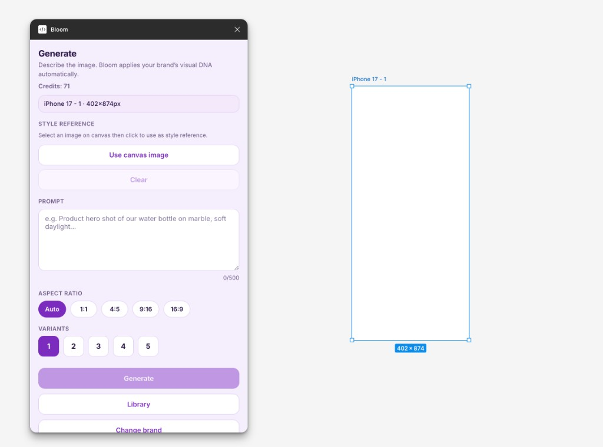

# Bloom – Figma Plugin

Generate on-brand images inside Figma using the Bloom API.
Select a frame, describe what you need, and Bloom generates
on-brand images that match your brand's visual identity.



## Features

- Generate on-brand images from any text prompt
- Auto-detects frame dimensions and maps to correct aspect ratio
- Generate 1-4 variants at once
- Replace existing image layers in one click
- Batch fill multiple frames simultaneously
- Use any canvas image as a style reference
- Edit generated images with text instructions

## How it works

1. Install the plugin in Figma Desktop
2. Connect your Bloom API key ([trybloom.ai/developers](https://www.trybloom.ai/developers))
3. Select your brand
4. Select a frame on your canvas
5. Describe what you want to generate
6. Click Generate — images appear on your canvas

## Setup for development

### Prerequisites

- Node.js 18+
- Figma Desktop app

### Install

```bash
npm install
```

### Build

```bash
npm run build        # production build
npm run watch        # development with hot reload
```

### Load in Figma

1. Run `npm run build` so `dist/code.js` and `dist/ui.html` exist
2. Open Figma Desktop
3. Plugins → Development → Import plugin from manifest
4. Select `manifest.json` from this folder

### Plugin ID (required before publishing)

`manifest.json` intentionally omits the `id` field so each customer owns their own Figma plugin identity. You can develop and import the plugin locally without an `id`.

When you are ready to publish to the Figma Community (or ship updates to an existing listing):

1. In Figma Desktop: Plugins → Development → **New plugin…** (or open your existing plugin project)
2. Copy the numeric `id` from the generated `manifest.json`, or copy the ID Figma shows when you first publish
3. Add it to this repo’s `manifest.json`:

```json
{
  "name": "Bloom – On-Brand Image Generator",
  "id": "YOUR_FIGMA_PLUGIN_ID",
  "api": "1.0.0",
  ...
}
```

Never reuse Bloom’s or another team’s plugin ID — Figma uses `id` to route updates to the correct listing.

## License

MIT — see [LICENSE](LICENSE).

## Project structure

- `src/code.ts` — Figma plugin sandbox (`figma.*` API, no DOM)
- `src/ui.html` — Plugin UI iframe markup and inline UI script (DOM + Bloom `fetch`, no `figma.*`)
- `manifest.json` — Plugin configuration

Additional sources: `src/ui-styles.ts` (webpack entry that pulls in styles), `src/ui.css`, `src/bloom-client.ts` and `src/bloom-api-schema.ts` (typed Bloom API shapes kept in sync with the inlined UI client), and `webpack.config.js`.

## Architecture note

Figma plugins run in two separate sandboxes:

- `code.ts` has access to `figma.*` and can use `fetch()` only for hosts allowed in `manifest.json` (for example downloading image bytes for insert/replace and proxying thumbnails for the UI).
- The UI (HTML + bundled script) can call the Bloom REST API with `fetch()` but cannot access `figma.*`.
- They communicate exclusively via `postMessage`.

Bloom JSON API traffic is implemented in the UI bundle (and mirrored for reference in `bloom-client.ts`). Canvas and storage operations run in `code.ts`.

## Get your Bloom API key

[trybloom.ai/developers](https://www.trybloom.ai/developers)
